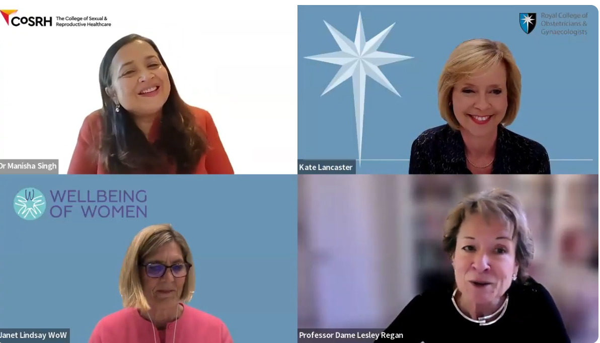

::: {style="text-align: center;"}
## #day21 in the Media
:::

::: {style="text-align: center;"}

[Discover the story behind #Day21 in our College of Sexual and Reproductive Health blog on fertility returning after childbirth and informed choice after births](https://www.cosrh.org/Public/Blogs/when-does-fertility-return-after-childbirth-and-why-does-this-matter.aspx)

 

 
:::

::: {style="text-align: center;"}

CoSRH podcast

Hear how #Day21 is challenging barriers in post-pregnancy contraceptive care and amplifying women’s voices:

 

<iframe data-testid="embed-iframe" style="border-radius:12px" src="https://open.spotify.com/embed/episode/1ujvlvnNJ2F1ce6iXuhfvd?utm_source=generator" width="80%" height="352" frameborder="0" allowfullscreen allow="autoplay; clipboard-write; encrypted-media; fullscreen; picture-in-picture" loading="lazy">

</iframe>

 

Subscribe to the full Voices in SRH podcast by listening on spotify:

 

 
:::

::: {style="text-align: center;"}

CoSRH Presidential Update

[Read CoSRH's May Presidential Update which features #day21 as part of a growing collaboration to bring attention to fertility return post-pregnancy](https://www.cosrh.org/Public/Public/Blogs/Presidents-Monthly-Updates-may-2026.aspx)

 

 
:::

::: {style="text-align: center;"}

Wellbeing of Women Webinar

Watch the video to hear CoSRH and the Women’s Health Ambassador for England discuss #Day21 during the Wellbeing of Women webinar on the updated Women’s Health Strategy:

 
:::

::::: {style="text-align:center;"}
:::: iframe-container
::: responsive-iframe
<iframe src="https://www.youtube.com/embed/85bbKl_Ua4Q?si=jJ8BlubsBPasaL48" title="YouTube video player" width="80%" height="352" frameborder="0" allow="autoplay; encrypted-media; picture-in-picture" allowfullscreen>

</iframe>
:::
::::
:::::

 

::: {style="text-align: center;"}
 

[The whole of the Wellbeing of Women webinar on the updated Women’s Health Strategy can be found here, discussing #day21 from 44 minutes:](https://www.youtube.com/watch?v=z2rmE4Nu7-M&t=2640s)

 

:::

 

::: {style="text-align: center;"}
   

  For more information please follow us on social media:

<a href="https://instagram.com/postnatalcontraception" 
   target="_blank"
   style="display: inline-flex; align-items: center; gap: 10px; text-decoration: none;">

<i class="bi bi-instagram" 
     style="font-size: 2rem; color: white;"></i>

</a>
:::

::: {style="text-align: center;"}
 

Get in touch by e-mail:

postnatalcontraception\@gmail.com

 

{width="80%" fig-align="center"}
:::
