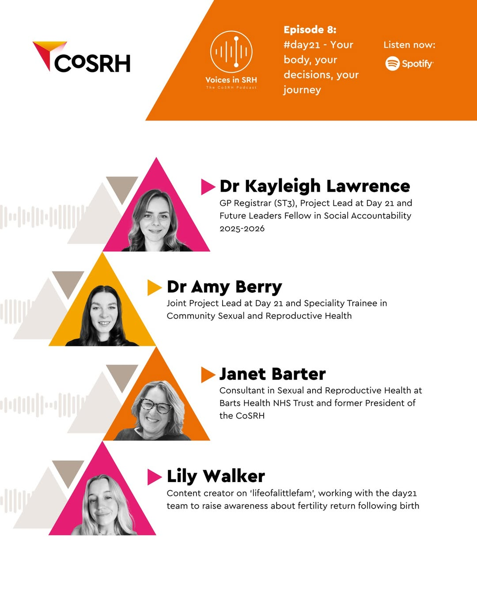
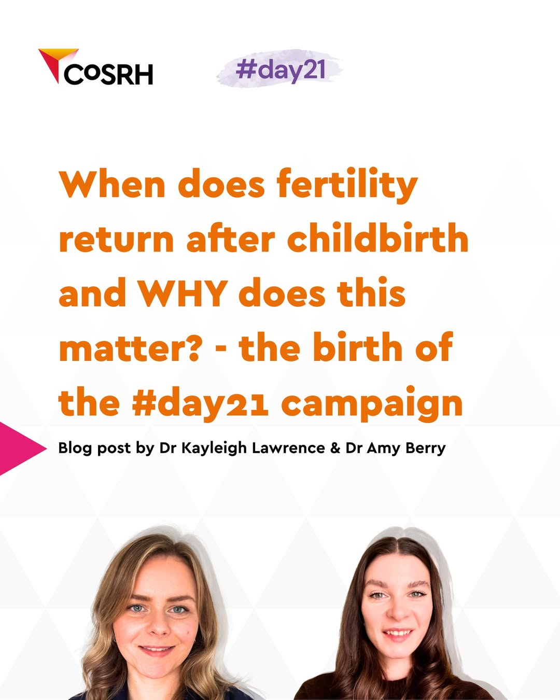

::: {style="text-align: center;"}
## Welcome to #day21
:::

::: text-center

Read CoSRH's May Presidential Update which features #day21 as part of a growing collaboration to bring attention to fertility return post-pregnancy:

[COSRH.org/](https://www.cosrh.org/Public/Public/Blogs/Presidents-Monthly-Updates-may-2026.aspx)

:::

::: text-center

CoSRH podcast: Hear how #Day21 is challenging barriers in post-pregnancy contraceptive care and amplifying women’s voices

 

<iframe data-testid="embed-iframe" style="border-radius:12px" src="https://open.spotify.com/embed/episode/1ujvlvnNJ2F1ce6iXuhfvd?utm_source=generator" width="50%" height="352" frameborder="0" allowfullscreen="" allow="autoplay; clipboard-write; encrypted-media; fullscreen; picture-in-picture" loading="lazy"></iframe>

 

 

Discover the story behind #Day21 in our College of Sexual and Reproductive Health blog on fertility returning after childbirth and informed choice after birth:

[COSRH.org blog](https://www.cosrh.org/Public/Blogs/when-does-fertility-return-after-childbirth-and-why-does-this-matter.aspx)

 

Watch to hear CoSRH and the Women’s Health Ambassador for England discuss #Day21 during the Wellbeing of Women webinar on the updated Women’s Health Strategy:

 

:::

::: {.iframe-container}
::: {.responsive-iframe}

<iframe 
  src="https://www.youtube.com/embed/ukDnjOFhnes?si=03xgiMbNZywyAyWY"
  title="YouTube video player"
  width="50%"
  height="352"
  frameborder="0"
  allow="autoplay; encrypted-media; picture-in-picture"
  allowfullscreen>
</iframe>

:::
:::

 

[The whole of the Wellbeing of Women webinar on the updated Women’s Health Strategy can be found here, discussing #day21 from 44 minutes](https://www.youtube.com/watch?v=z2rmE4Nu7-M&t=2640s)

 

::: text-center

{width="50%" fig-align="center"}

:::
