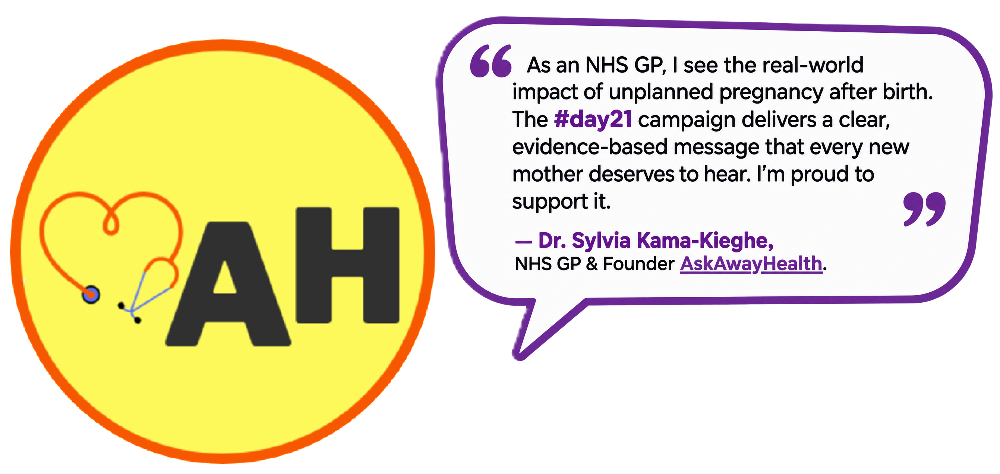
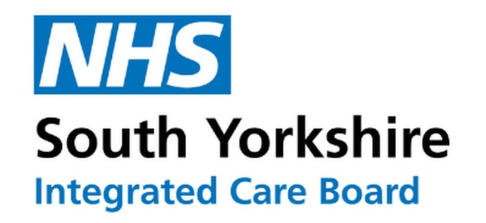

::: {style="text-align: center;"}
## Endorsements
:::

::: {style="text-align: center;"}
#day21 is endorsed and supported by the following organisations:

     

<b>

The College of Sexual & Reproductive Healthcare

</b>

[COSRH.org/](https://www.cosrh.org/)

     

Dr Alison Wright, President of the Royal College of Obstetricians and Gynaecologists, said:

"Far too many women face difficulties and delays in accessing contraception, including after giving birth. These barriers have real and lasting consequences for women's health, autonomy and future care needs. #Day21 is an important campaign working to ensure women get the right contraception support after pregnancy, so they can make fully informed choices about their reproductive health."

     

<b>

The Lowdown: A Women's Health Review Platform

</b>

[TheLowdown.com](https://thelowdown.com/)

 

     

<b>

AskAwayHealth 

</b>

Women's health answers from a UK GP - so you're prepared, not panicked

 

[AskAwayHealth.org](https://askawayhealth.org/)

 

:::

::: {style="text-align: center;"}
     

<b>

South Yorkshire Integrated Care Board

</b>

[SouthYorkshire.ICB.nhs.uk](https://southyorkshire.icb.nhs.uk)
:::

 

   

::: {style="text-align: center;"}
     

  For more information please follow us on social media:

<a href="https://instagram.com/postnatalcontraception" 
   target="_blank"
   style="display: inline-flex; align-items: center; gap: 10px; text-decoration: none;">

<i class="bi bi-instagram" 
     style="font-size: 2rem; color: white;"></i>

</a>

Get in touch by e-mail:

postnatalcontraception\@gmail.com
:::
