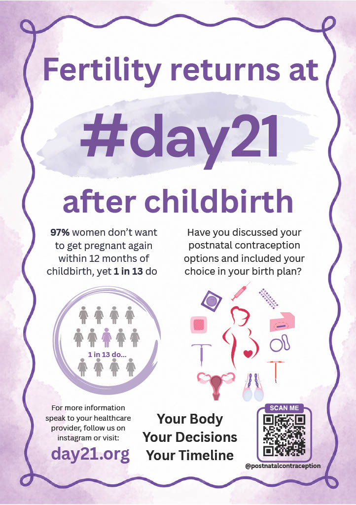
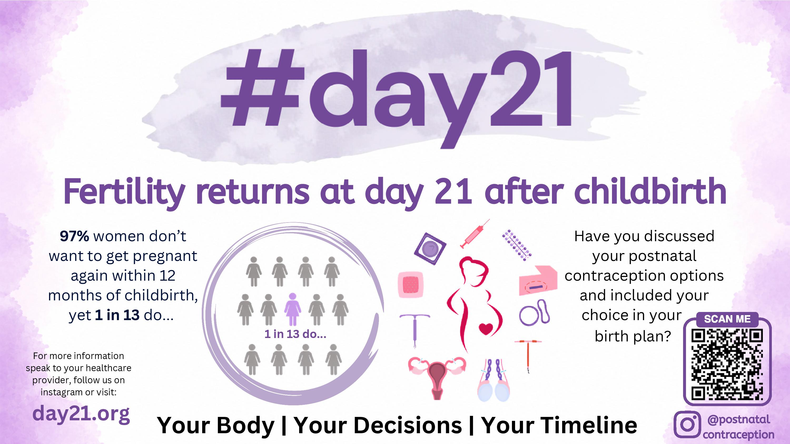
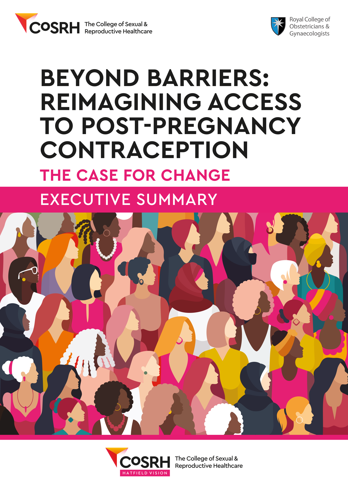
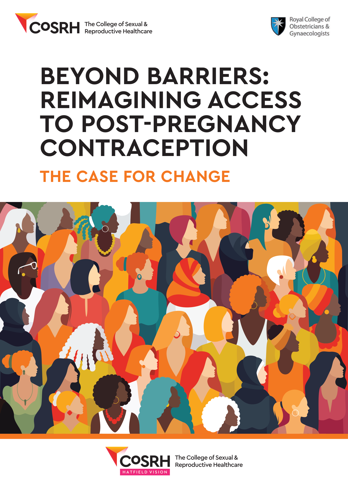
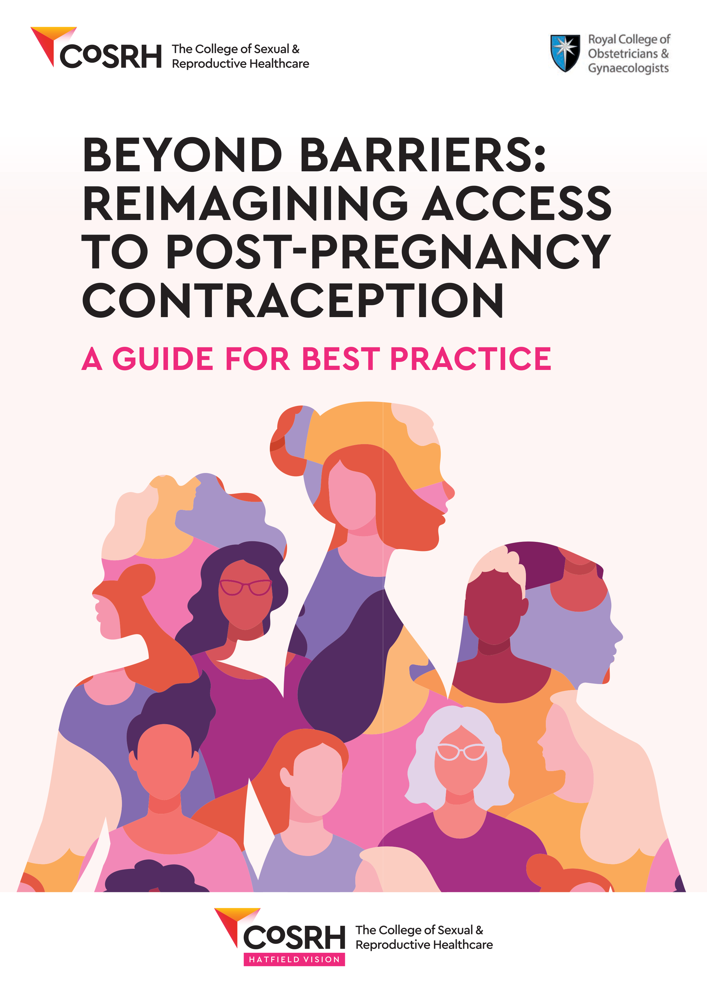

::: {style="text-align: center;"}
## Welcome to #day21

:::

::: {style="text-align: center;"}
 
[Download our poster to display in your working area:](downloads/Poster_FINAL.pdf){download="POSTER.pdf"}
 
:::

::: {style="text-align: center;"}
{width="80%" fig-align="center"}
:::

::: {style="text-align: center;"}
 
[Download our digital slide for your waiting room screens:](downloads/digital_slide.pdf){download="POSTER.pdf"}
 
:::

::: {style="text-align: center;"}
{width="80%" fig-align="center"}
:::

::: {style="text-align: center;"}
 
[Access the College of Sexual & Reproductive Healthcare reports reimagining access to post-pregnancy contraception here: ](https://www.cosrh.org/Public/Public/News-and-Advocacy/Beyond-barriers-reimagining-access-to-post-pregnancy-contraception.aspx)
 
:::

::: {style="display:flex; justify-content:center; gap:2rem; flex-wrap:wrap;"}

:::

 

::: {style="text-align: center;"}

[Patient Information Leaflet on postnatal contraception options](downloads/Manchester_leaflet_postnatal_contraception.pdf){download="LEAFLET.pdf"}

 
 
[Leaflets available in several languages](https://sites.google.com/sheffield.ac.uk/the-app/leaflets?authuser=0)

   

Get in touch by e-mail:

postnatalcontraception\@gmail.com

   

For more information please follow us on social media:

<a href="https://instagram.com/postnatalcontraception" target="_blank"> <i class="bi bi-instagram" style="font-size: 2rem;"></i> </a>

{width="80%" fig-align="center"}
:::
