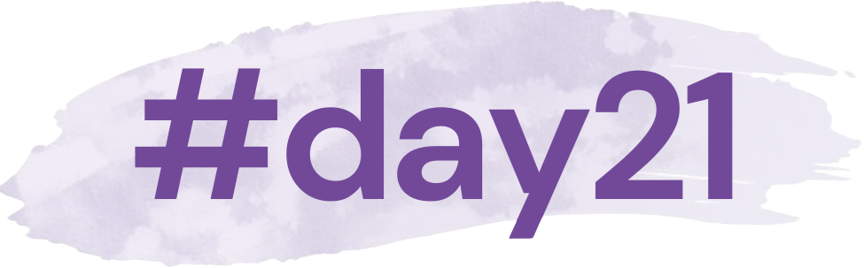

::: {style="text-align: center;"}

## References

:::

::: ref-list

1)  [Beyond Barriers: Reimagining Access to Post-Pregnancy Contraception – The Case for Change. College of Sexual and Reproductive Healthcare (CoSRH); Royal College of Obstetricians and Gynaecologists (RCOG). 2025](downloads/the_case_for_change.pdf){download="the_case_for_change.pdf"}

2)  [National Institute for Health and Care Excellence. Quality statement 4: Contraception after childbirth. NICE Quality Standard QS129. September 2016](downloads/NICE_contraception_advice_after_childbirth.pdf){download="NICE_contraception_advice_after_childbirth.pdf"} 

3)  [Royal College of Obstetricians & Gynaecologists. Birth after Previous Caesarean Birth. Green-top Guideline No 45. October 2015](downloads/green_top_guideline_birth_after_previous_caesarean.pdf){download="green_top_guideline_birth_after_previous_caesarean.pdf"}

4)  [College of Sexual and Reproductive Healthcare. Contraception After Pregnancy. FSRH Guideline. October 2020](downloads/FSRH_guideline_contraception_after_pregnancy.pdf){download="FSRH_guideline_contraception_after_pregnancy.pdf"}

5)  [Schummers L, Hutcheon JA, Hernandez-Diaz S, Williams PL, Hacker MR, VanderWeele TJ, Norman WV. Association of Short Interpregnancy Interval With Pregnancy Outcomes According to Maternal Age. JAMA Intern Med. 2018 Dec 1;178(12):1661-1670. doi: 10.1001/jamainternmed.2018.4696. PMID: 30383085; PMCID: PMC6583597](downloads/Schummers_et_al.pdf){download="Schummers_et_al.pdf"}

6)  [Wendt A, Gibbs CM, Peters S, Hogue CJ. Impact of increasing inter-pregnancy interval on maternal and infant health. Paediatr Perinat Epidemiol. 2012 Jul;26 Suppl 1(0 1):239-58. doi: 10.1111/j.1365-3016.2012.01285.x. PMID: 22742614; PMCID: PMC4562277](downloads/Wendt_et_al.pdf){download="Wendt_et_al.pdf"}

7)  [Office for Health Improvement & Disparities. (2025). Sexual and reproductive health profiles: statistical commentary, March 2025. GOV.UK. https://www.gov.uk/government/statistics/sexual-and-reproductive-health-profiles-march-2025-update/sexual-and-reproductive-health-profiles-statistical-commentary-march-2025](downloads/sexual_and_reproductive_health_profiles_statistical_commentary_march_2025.pdf){download="sexual_and_reproductive_health_profiles_statistical_commentary_march_2025.pdf"} (accessed 2nd September 2026)

8)  [Abortion statistics in England and Wales. Office for Health Improvement and Disparities, Department of Health and Social Care; United Kingdom Government. www.gov.uk/government/collections/abortion-statistics-for-england-and-wales](downloads/abortion_statistics_in_england_and_wales.pdf){download="abortion_statistics_in_england_and_wales.pdf"} (accessed 2nd September 2026)

9) [Public Health England (2021) Contraception return on investment tool: maternity and primary care settings](downloads/return_on_investment_tool_description.pdf){download="return_on_investment_tool_description.pdf"} [(Download the tool here)](downloads/return_on_investment_tool.ods){download="return_on_investment_tool.ods"}

10)  [Report of a WHO technical consultation on birth spacing: Geneva, Switzerland 13–15 June 2005. Geneva: World Health Organization, 2007](downloads/who_technical_consultation_on_birth_spacing.pdf){download="who_technical_consultation_on_birth_spacing.pdf"}

11)  [National Institute for Health and Care Excellence. Scenario: Pre-conception advice for all women. NICE CKS. June 2025, https://cks.nice.org.uk/topics/pre-conception-advice-management](downloads/NICE_pre-conception_advice_for_all_women.pdf){download="NICE_pre-conception_advice_for_all_women.pdf"} (accessed 2nd September 2026)

12)  [Javed, M., Baloch, F. N., & Verma, V. (2026). From Birth to Unintended Pregnancy: Postnatal Contraception Failures in the First Postpartum Year. Cureus, 18 (3), e10552. doi:10.7759/cureus.10552](downloads/Javed_et_al.pdf){download="Javed_et_al.pdf"}

13)  [Mühlrad, H., Björkegren, E., Haraldson, P., Bohm-Starke, N., Kopp Kallner, H. and Brismar Wendel, S. (2022) 'Interpregnancy interval and maternal and neonatal morbidity: a nationwide cohort study', Scientific Reports, 12, Article 17402](downloads/Muhlrad_et_al.pdf){download="Muhlrad_et_al.pdf"}

 

:::

::: {style="text-align: center;"}

 

  For more information please follow us on social media:

<a href="https://instagram.com/postnatalcontraception" 
   target="_blank"
   style="display: inline-flex; align-items: center; gap: 10px; text-decoration: none;">
  
  <i class="bi bi-instagram" 
     style="font-size: 2rem; color: white;"></i>

  
       
</a>

Get in touch by e-mail:

postnatalcontraception\@gmail.com
:::

::: {style="text-align: center;"}
{width="80%" fig-align="center"}
:::
